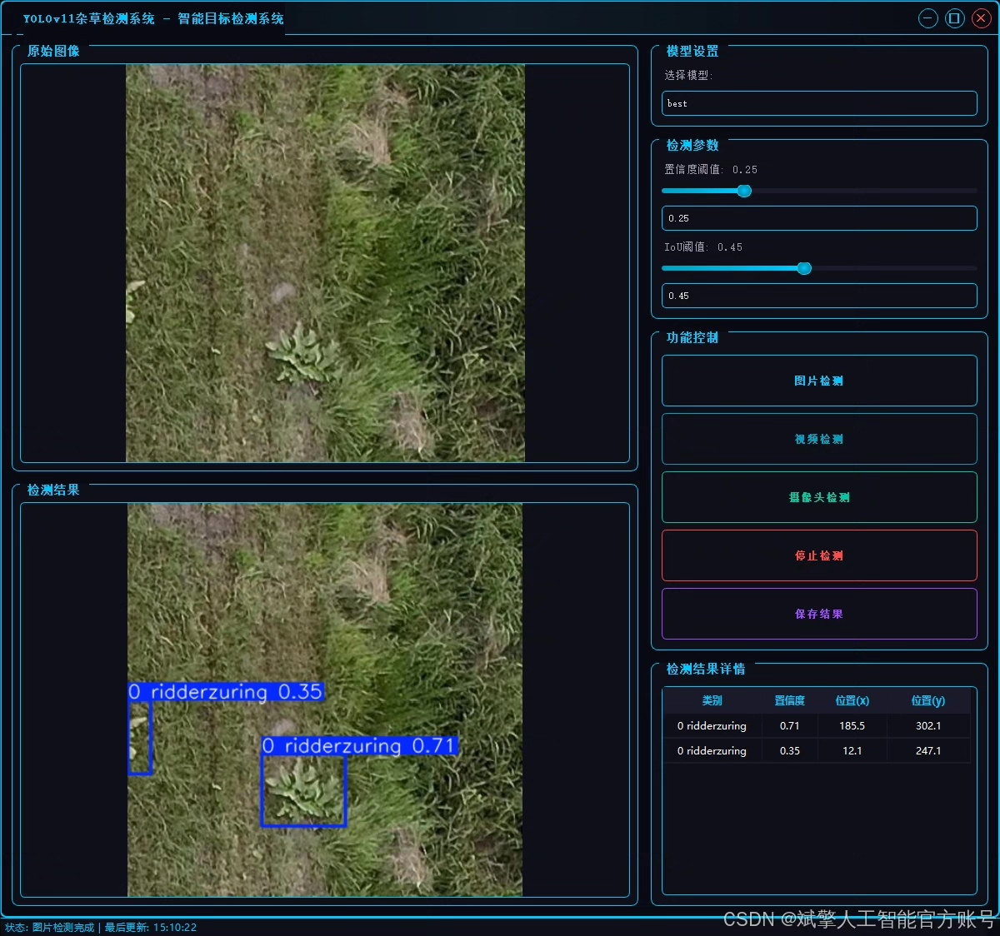
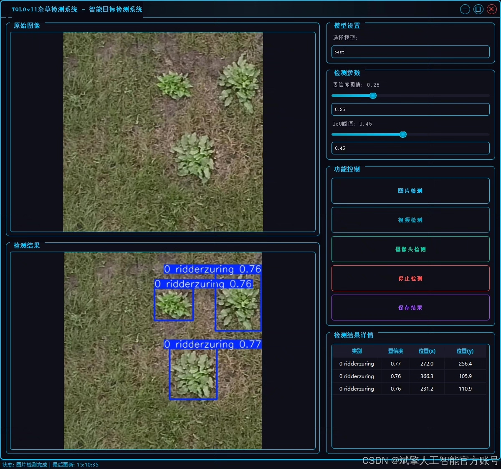
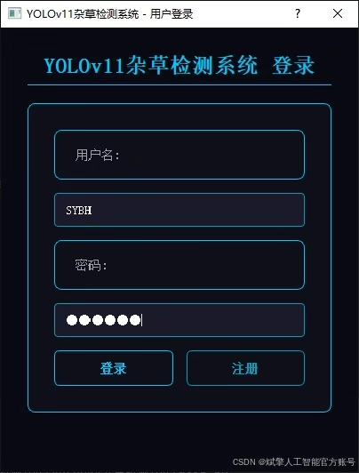
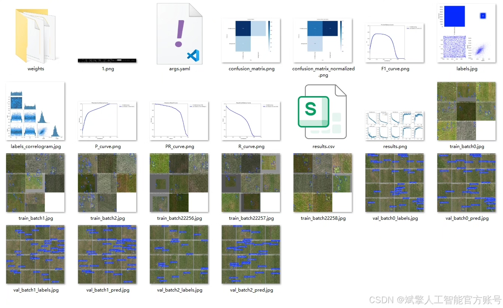
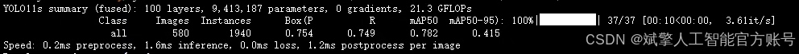
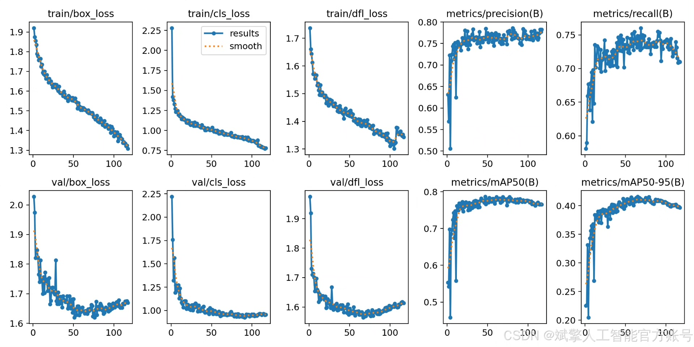
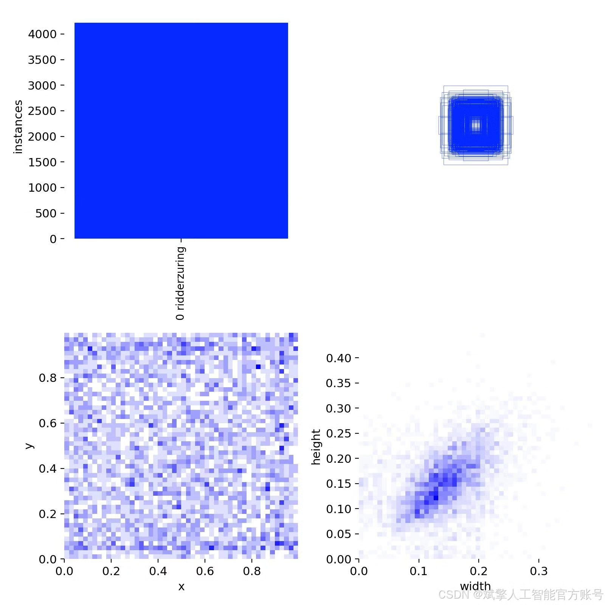
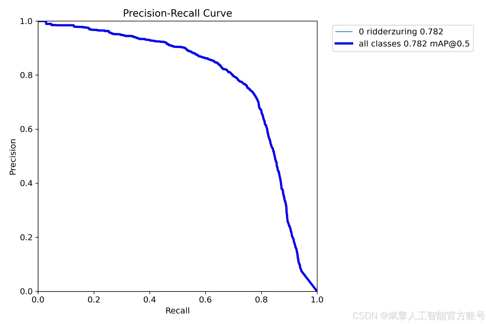

# YOLOv11 weed detection system

## Body

YOLOv11 Weed Detection System Based on Deep Learning YOLOv11 (YOLOv11+YOLO dataset + UI interface + login and registration interface + Python project source code + model)

nc: 1 class,
Name: ['0 ridderzuring'],
Dataset quantity: training set 1661, validation set 580, test set 245.

✅ User Login and Registration: Supports password detection and security verification.

✅ Three detection modes: based on the YOLOv11 model, supports image, video, and real-time camera three detection, accurately recognizes the target.

✅ Dual-screen comparison: Display the original scene and detection results in the same screen.

✅ Data visualization: Real-time table displaying the category, confidence, and coordinates of detected targets.

✅ Intelligent parameter adjustment: Offers a confidence slide bar to dynamically optimize detection accuracy, adapting to different scene requirements.

✅ Sci-fi style interactive interface: Dark theme combined with dynamic light effects, reducing visual fatigue and improving operational experience.

## Images

## Payment

Here is a pay link on Stripe ( https://buy.stripe.com/3cs8yP7sY87d0vu9AB ). Please contact me lonlonago@foxmail.com after funding $89, and I will send you a complete data files , thank you!

